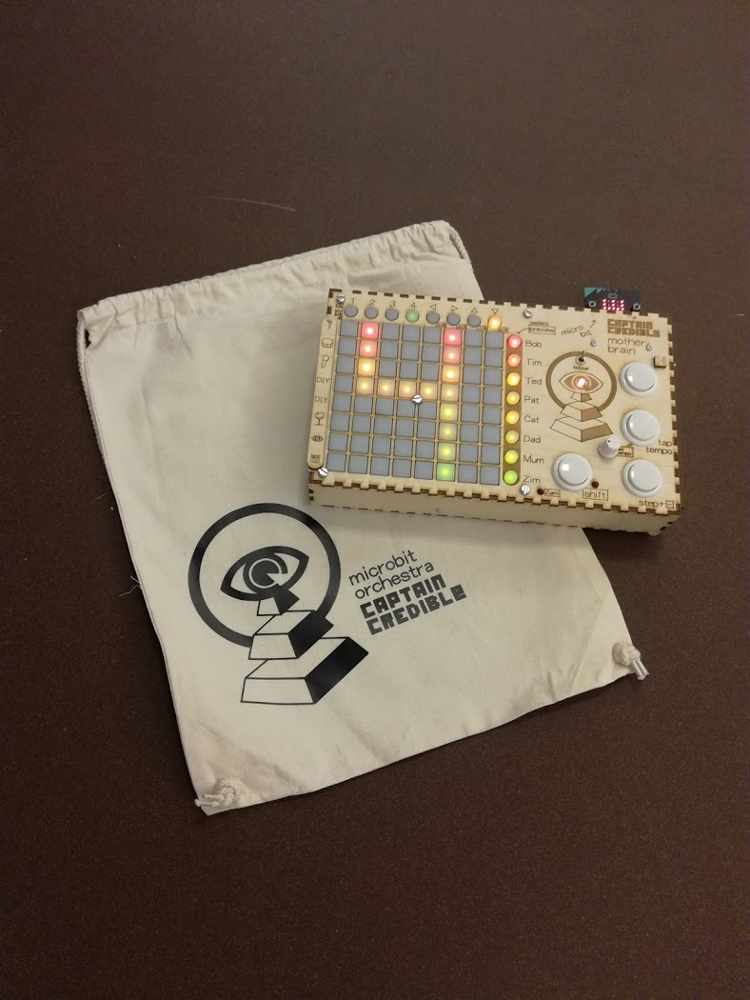

Motherbrain is a USBMIDI interface and 32 step sequencer with 8 channels for Micro:bit Orchestras.
This code needs to run on a Atmega32u4 and communicates with a novation launchpad via serial to USB host adapter from hobbytronics.
The atmega also communicates with a Micro:bit via i2C.

